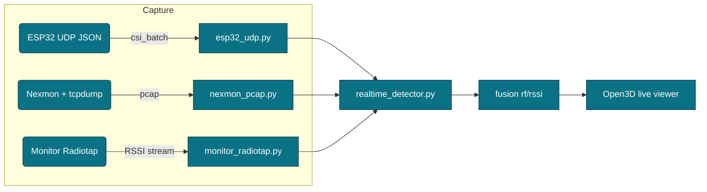
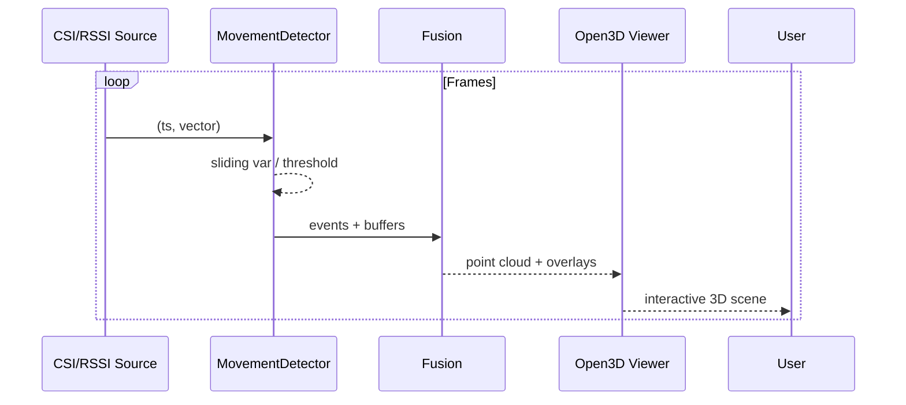

<p align="center">
  
</p>

# WiFi-3D-Fusion

<p align="center">
  <!-- Project -->
  
  
</p>

<p align="center">
  <!-- Languages -->
  
  
  
</p>

<p align="center">
  <!-- Tools & Libs -->
  
  
  
  
  
  
  
</p>


**Live local Wi-Fi sensing** with CSI: real-time motion detection + visualization, with optional bridges to:
- **Person-in-WiFi-3D** (multi-person **3D pose** from Wi-Fi) [CVPR 2024].  
- **NeRF²** (neural RF radiance fields).  
- **3D Wi-Fi Scanner** (RSSI volumetric mapping).

This monorepo is production-oriented: robust CSI ingestion from **local Wi-Fi** (ESP32-CSI via UDP, or **Nexmon** via `tcpdump` + `csiread`), a realtime movement detector, and a 3D viewer.

---

## Quick start

```bash
bash scripts/install_all.sh
# ESP32-CSI UDP (default port 5566):
./scripts/run_realtime.sh --source esp32

# Or Nexmon (requires monitor-mode iface and nexmon_csi firmware)
sudo ./scripts/run_realtime.sh --source nexmon
````

> GPU is only needed if you enable the 3D pose or NeRF² bridges. Realtime detector/visualizer runs on CPU.

---

## Hardware paths

### A) ESP32-CSI (recommended to start)

* Flash **ESP32-CSI-Tool** on an ESP32. Configure it to **send CSI via UDP** to your PC’s IP and port **5566** (or change `esp32_udp_port` in `configs/fusion.yaml`).
* This repo listens and parses JSON CSI payloads (`type: "CSI_DATA"` with `csi` array).

### B) Nexmon (Broadcom chips)

* Install **nexmon\_csi** on a compatible device (e.g., RPi 3B+/4 with bcm43455c0).
* Put your capture interface in monitor mode (e.g., `wlan0`).
* We tail a rolling pcap via `tcpdump` and parse CSI with **csiread** in near-real-time.

---

## What you get out-of-the-box

* **CSI capture**:

  * `src/csi_sources/esp32_udp.py` — ESP32-CSI UDP JSON receiver.
  * `src/csi_sources/nexmon_pcap.py` — Nexmon CSI via `tcpdump` + `csiread`.
* **Realtime analytics**:

  * `src/pipeline/realtime_detector.py` — movement detector using amplitude-variance over a sliding window.
* **3D visualization**:

  * `src/pipeline/realtime_viewer.py` — Open3D live point cloud (frequency × antenna × amplitude). It displays **real CSI** dynamics; no dummy data.

---

## Optional bridges (disabled by default)

### 1) Person-in-WiFi-3D (3D pose)

* Repo: `third_party/Person-in-WiFi-3D-repo`
* Enable in `configs/fusion.yaml`: `enable_pose3d: true`
* Place a compatible checkpoint at `env/weights/pwifi3d.pth`.
* Prepare test data under the repo’s expected structure (`data/wifipose/test_data/...`), then run:

  ```bash
  python -m src.bridges.pwifi3d_runner \
    third_party/Person-in-WiFi-3D-repo config/wifi/petr_wifi.py env/weights/pwifi3d.pth
  ```

  *(We shell out to OpenMMLab’s `tools/test.py` inside the repo.)*

### 2) NeRF² (RF field)

* Repo: `third_party/NeRF2`
* Enable in `configs/fusion.yaml`: `enable_nerf2: true`
* Train:

  ```bash
  python -m src.bridges.nerf2_runner
  ```

### 3) 3D Wi-Fi Scanner (RSSI volume)

* Repo: `third_party/3D_wifi_scanner`
* Use that tooling to generate volumetric RSSI datasets; you can integrate them into your own fusion pipeline if desired.

---

## Configuration

Edit `configs/fusion.yaml`:

* `source: esp32 | nexmon`
* `esp32_udp_port`, `nexmon_iface`, etc.
* Detector thresholds: `movement_threshold`, `win_seconds`, `debounce_seconds`.

---

## Docker

```bash
docker compose build
docker compose run --rm fusion
```

---

## Notes

* For **Nexmon**, you need `tcpdump` privileges. The Dockerfile includes it; on host, install it and run as root/sudo.
* For **Person-in-WiFi-3D**, follow that repo’s requirements (PyTorch, MMCV/MMDet). Our `scripts/install_all.sh` installs compatible versions.
* For **ESP32-CSI**, UDP JSON payloads compatible with common forks are supported.

---

### Usage (super short)
````
bash create_wifi3d_fusion.sh
cd wifi-3d-fusion
bash scripts/install_all.sh
./scripts/run_realtime.sh --source esp32     # or --source nexmon
````

If you want the Docker path:

```bash
docker compose build
docker compose run --rm fusion
```
---

## 🔧 System Requirements & Dependencies

* **OS:** Ubuntu 22.04+ (tested with Kernel 6.14)
* **Python:** 3.12 (venv managed by `scripts/install_all.sh`)
* **GPU:** Optional (only for Pose3D/NeRF² bridges)
* **Packages (auto-installed):**

  * Base: `numpy`, `pyyaml`, `loguru`, `tqdm`, `open3d`, `opencv-python`, `einops`, `watchdog`, `pyzmq`, `matplotlib`, `csiread==1.4.1`
  * Optional Pose3D: `torch` + `torchvision` (cu118/cu121 or cpu), `openmim`, `mmengine`, `mmcv`, `mmdet`
* **System tools for capture (optional):** `tcpdump`, `tshark/wireshark`, `aircrack-ng`, `iw`

> The installer keeps Torch/`openmim` on **default PyPI** (no PyTorch index bleed) and pins `csiread` to a wheel compatible with Python 3.12.

---

## 🧭 Sources & Modes

* `--source esp32` → UDP JSON from **ESP32-CSI** on `esp32_udp_port` (default **5566**).
* `--source nexmon` → **Broadcom Nexmon CSI** via rolling PCAP (`tcpdump`) parsed by **csiread**.
* `--source monitor` (optional) → **Monitor-mode RSSI** using Radiotap (Scapy/PyShark fallback).
  Configure interface/channel externally; pass with `--iface mon0`.

---

## 🧪 End-to-End: What gets installed and why

* **`scripts/install_all.sh`**

  * Creates `.venv`, upgrades `pip/wheel/setuptools`
  * Installs `requirements.txt` (Open3D viewer, analytics, IO)
  * Clones **third\_party** repos: Person-in-WiFi-3D, NeRF², 3D\_wifi\_scanner
  * (If `WITH_POSE=true`) installs Torch (per `TORCH_CUDA`), `openmim`, `mmengine`, `mmcv`, `mmdet`

* **`scripts/run_realtime.sh`**

  * Launches the realtime pipeline:

    * Source adapter (`esp32_udp` / `nexmon_pcap` / optional `monitor_radiotap`)
    * Movement detection (`src/pipeline/realtime_detector.py`)
    * Live 3D viewer (`src/pipeline/realtime_viewer.py`)

* **Optional capture helpers**

  * `scripts/setup_monitor.sh` (creates `mon0` and pins channel)
  * External tools: `airmon-ng`, `tcpdump`, `tshark` for debugging traffic

---

## ▶️ How to Run (step-by-step)

### A) ESP32-CSI (recommended first)

```bash
# 1) Install all
bash scripts/install_all.sh

# 2) Make ESP32 send UDP JSON to your PC:5566 (or adjust configs/fusion.yaml)
# 3) Run
./scripts/run_realtime.sh --source esp32
```

### B) Nexmon CSI (Broadcom)

```bash
# 1) Enable monitor on the capture device (e.g., wlan0)
# 2) Run pipeline (uses tcpdump + csiread internally)
sudo ./scripts/run_realtime.sh --source nexmon
```

### C) Monitor-mode RSSI (optional)

```bash
# 1) Create mon interface; set channel with your tool of choice
bash scripts/setup_monitor.sh wlx<yourif>   # or just `bash scripts/setup_monitor.sh`
# 2) Force PyShark fallback if Scapy lacks RSSI
#    sed -i 's/_SCAPY_OK = True/_SCAPY_OK = False/' src/csi_sources/monitor_radiotap.py
# 3) Run
sudo -E env PATH="$PWD/.venv/bin:$PATH" ./scripts/run_realtime.sh --source monitor --iface mon0
```

---

## 🧩 Architecture

<p align="center">
  
</p>

### High-level runtime



### Model Training

<p align="center">
  
</p>


### Processing loop



---

## 🛡️ Troubleshooting

* **Blank Open3D window**
  Ensure data is flowing:

  * ESP32: `sudo tcpdump -n -i any udp port 5566`
  * Nexmon: `sudo tcpdump -i wlan0 -s 0 -vv -c 20`
  * Monitor: `sudo tshark -I -i mon0 -a duration:5 -T fields -e radiotap.dbm_antsignal | head`
    Install GL if needed: `sudo apt-get install -y libgl1`

* **`openmim` not found / Torch index issues**
  Use the provided `install_all.sh` (Torch from PyTorch index only for Torch, `openmim` from PyPI).
  For Pose3D:
  `WITH_POSE=true TORCH_CUDA=cu121 bash scripts/install_all.sh`

* **`csiread` wheel mismatch**
  Python 3.12 → pin to `csiread==1.4.1` (already in requirements flow).

* **Monitor interface won’t capture**
  Kill network managers, recreate `mon0`, fix channel:
  `sudo airmon-ng check kill && bash scripts/setup_monitor.sh`

---

## 🔏 Legal / Research Notice

This repository is provided **By Malios Dark for research purposes only**.
You are responsible for complying with local laws and for using it **only on networks you own or have explicit permission to test**.


## 📚 Citations / Upstreams

1. [End-to-End Multi-Person 3D Pose Estimation with Wi-Fi (CVPR 2024)](https://openaccess.thecvf.com/content/CVPR2024/papers/Yan_Person-in-WiFi_3D_End-to-End_Multi-Person_3D_Pose_Estimation_with_Wi-Fi_CVPR_2024_paper.pdf)  
2. [GitHub - aiotgroup/Person-in-WiFi-3D-repo](https://github.com/aiotgroup/Person-in-WiFi-3D-repo)  
3. [NeRF2: Neural Radio-Frequency Radiance Fields (MobiCom 2023)](https://web.comp.polyu.edu.hk/csyanglei/data/files/nerf2-mobicom23.pdf)  
4. [GitHub - XPengZhao/NeRF2](https://github.com/XPengZhao/NeRF2)  
5. [GitHub - Neumi/3D_wifi_scanner](https://github.com/Neumi/3D_wifi_scanner)  
6. [Hackaday - Visualizing WiFi With A Converted 3D Printer](https://hackaday.com/2021/11/22/visualizing-wifi-with-a-converted-3d-printer/)  
7. [GitHub - StevenMHernandez/ESP32-CSI-Tool](https://github.com/StevenMHernandez/ESP32-CSI-Tool)  
8. [GitHub - citysu/csiread](https://github.com/citysu/csiread)  


---


