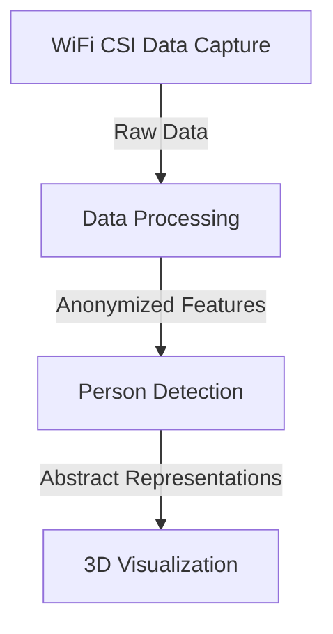
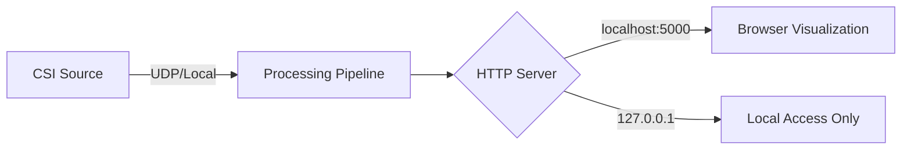
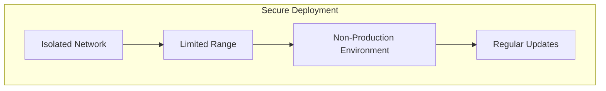
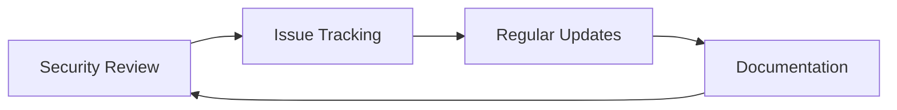

# Security Policy

## Overview

This document outlines the security considerations, policies, and recommendations for the WiFi-3D-Fusion project. As the developer of this research-focused WiFi sensing platform, I'm committed to addressing security concerns and promoting responsible use of this technology.

## Security Considerations

### WiFi Data Privacy

#### Data Collection
- **Channel State Information (CSI)** captured by this system represents radio signal characteristics, not packet contents
- CSI data does not include any WiFi packet payloads, usernames, passwords, or browsing data
- The system operates passively and doesn't perform packet injection or network disruption

#### Data Storage
- CSI data is processed in memory and not persistently stored by default
- When data logging is enabled, files are stored locally and not transmitted externally
- Sample data included in the repository is synthetic or anonymized

### Network Security

#### Local HTTP Server
- The visualization server binds to localhost (127.0.0.1) by default
- No authentication is implemented as the server is intended for local use only
- Data API endpoints provide processed data without sensitive information

#### ESP32 UDP Reception
- UDP socket for ESP32 data reception has no authentication mechanism
- Should only be used in controlled research environments
- Not designed for deployment in security-critical or public networks

## Vulnerability Reporting

If you discover a security vulnerability in WiFi-3D-Fusion, please report it by creating a GitHub issue with the title formatted as `[SECURITY] Brief description`. I'll investigate all legitimate reports and do my best to address the issue quickly.

Please include the following in your report:
- Steps to reproduce the vulnerability
- Potential impact of the vulnerability
- Any suggested mitigations (optional)

## Secure Deployment Recommendations

### Research Environment Setup

1. **Isolated Network**: Run the system on an isolated research network
2. **Limited Range**: Configure WiFi devices to use minimum required power
3. **Consent**: Ensure all participants in research studies provide informed consent
4. **Data Protection**: Apply appropriate access controls to any stored data
5. **Update Dependencies**: Keep all dependencies updated to their latest secure versions

### Monitor Mode Considerations

The WiFi monitor mode used by some CSI sources has security implications:
- Monitor mode allows capturing all WiFi frames in the vicinity
- This capability is provided for research purposes only
- Using monitoring tools in unauthorized networks may violate local laws and regulations

## Security Features

### Data Protection

- CSI processing pipeline focuses on abstract features, not identifying information
- Person detection uses numeric IDs and does not associate with personal identifiers
- Visualization represents persons as abstract skeletons or point clouds

### System Protection

- The system uses socket reuse protection to prevent port conflicts
- Auto-recovery mechanisms prevent system freezes and unauthorized resource consumption
- Docker containerization provides isolation from the host system when used

## Ethical Guidelines

As the developer of this system, I encourage all users to adhere to these ethical guidelines:

1. Only deploy in environments where all participants are aware of the system
2. Do not use for surveillance without proper consent and legal authorization
3. Protect any collected data according to applicable privacy regulations
4. Use the technology for beneficial research and applications

## Continuous Security Improvement

I'm committed to continuously improving the security of WiFi-3D-Fusion:

- Regular review of dependencies for known vulnerabilities
- Updates to address security concerns as they are discovered
- Documentation improvements to guide secure deployment

## Disclaimer

WiFi-3D-Fusion is provided as a research tool. It should be used responsibly and in compliance with all applicable laws and regulations. I am not responsible for any misuse of this technology.

## Contact

For security-related inquiries, please open a GitHub issue as described above or contact me directly through my GitHub profile.

---

*Last updated: August 26, 2025*
